# 🚀 Job Portal Application

A full-stack **Job Portal Web Application** built with **Spring Boot**, **Thymeleaf**, **Spring Security**, and **MySQL**. The platform supports three distinct user roles — **Guest**, **Job Seeker (Candidate)**, and **Recruiter** — each with a tailored experience.

---

## 📋 Table of Contents

- [Tech Stack](#-tech-stack)
- [Getting Started](#-getting-started)
- [Features Overview](#-features-overview)
  - [🌐 Guest Users](#-guest-users)
  - [🎓 Candidate Users](#-candidate-users)
  - [🏢 Recruiter Users](#-recruiter-users)
- [UI Highlights](#-ui-highlights)
- [Project Structure](#-project-structure)

---

## 🛠 Tech Stack

| Layer | Technology |
|---|---|
| Backend | Java 17, Spring Boot 3, Spring MVC, Spring Security |
| Frontend | Thymeleaf, HTML5, CSS3, Bootstrap 5, jQuery |
| Database | MySQL, Spring Data JPA / Hibernate |
| Build Tool | Maven |
| File Storage | Local filesystem (photos & resumes) |

---

## ⚡ Getting Started

1. **Clone the repo**
   ```bash
   git clone https://github.com/your-username/hotdevjobs.git
   cd hotdevjobs
   ```

2. **Configure your database** in `src/main/resources/application.properties`:
   ```properties
   spring.datasource.url=jdbc:mysql://localhost:3306/jobportal
   spring.datasource.username=your_username
   spring.datasource.password=your_password
   ```

3. **Run the application**:
   ```bash
   mvn spring-boot:run
   ```

4. Open your browser at `http://localhost:8080`

---

## 🌟 Features Overview

---

### 🌐 Guest Users

> No account needed. Just visit and explore.

**Landing Page** — A clean, animated landing page with a dynamic cycling text animation and a prominent search bar.

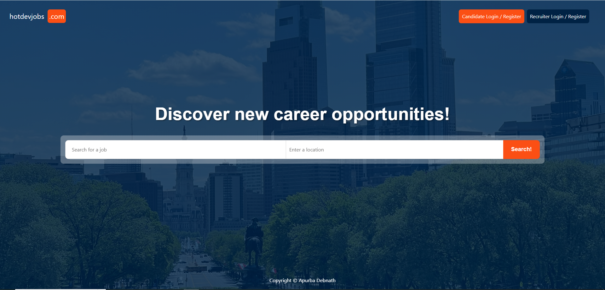

---

**Global Job Search** — Search for jobs by **role** and **location** directly from the landing page.


---

**Advanced Filtering** — Filter results by:
- 📅 **Date Posted** — Today, Last 7 Days, Last 30 Days
- 🌍 **Remote** — Remote-Only, Office-Only, Partial-Remote
- 💼 **Employment Type** — Full-Time, Part-Time, Freelance

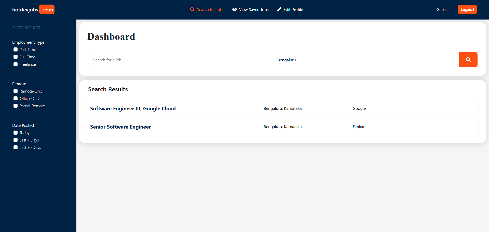

---

### 🎓 Candidate Users

> Register or log in to unlock the full candidate experience.

#### 🔐 Authentication

**Register** — Create a new account as a Job Seeker or Recruiter.

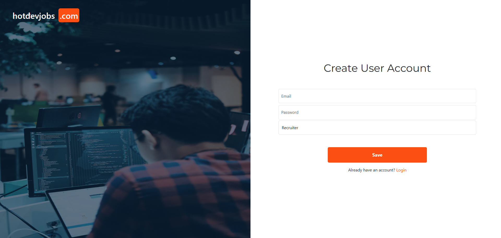

**Login** — Securely log into your account.

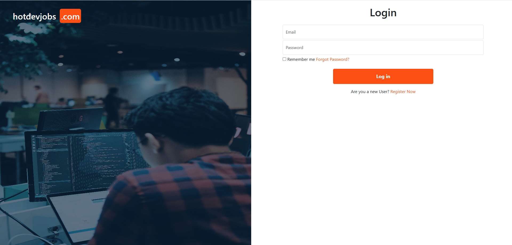

---

#### 📊 Candidate Dashboard

After logging in, candidates land on their personalised dashboard — a live feed of available job openings across companies, showing job title, location, and company name. Jobs the candidate has already applied to or saved are clearly labelled.

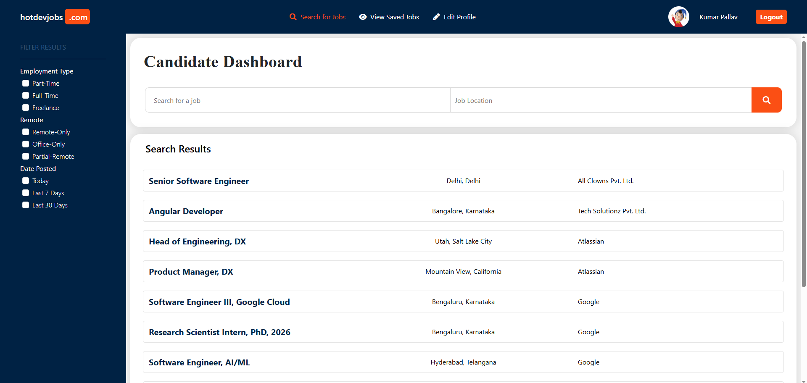

---

#### 🔎 Search & Filter

Search for specific roles or locations using the search bar at the top of the dashboard, and refine results with the sidebar filters (Date Posted, Remote, Employment Type).

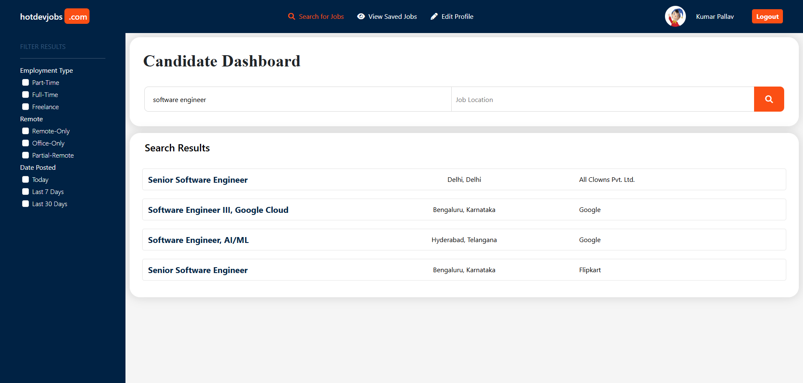
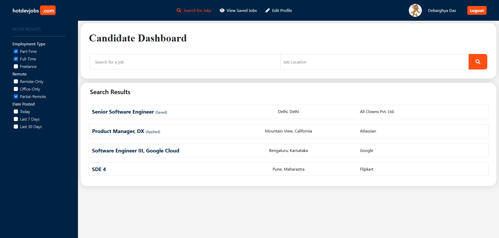

---

#### 📄 Job Details & Apply

Click on any job listing to view the full **job description**, salary, type, and remote status. From there, candidates can:

- ✅ **Apply Now** — Submit their application with one click.
- 🔖 **Save Job** — Bookmark the job for later review.

If already applied or saved, the button is disabled with an appropriate label.

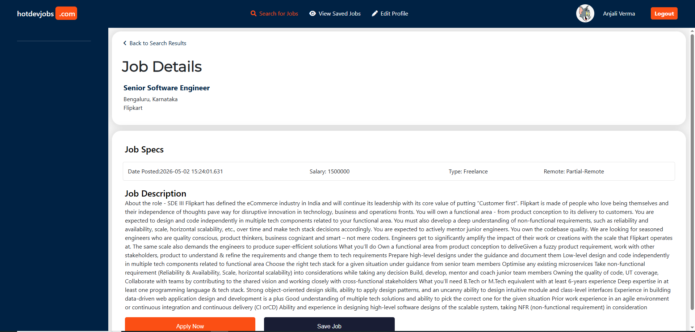

---

#### 🔔 Success Popups

After applying or saving, a **toast notification** appears at the top center of the screen and automatically disappears after 3 seconds.

- 🟢 **"Successfully Applied!"** — Popup on successful application.

  

- 🟣 **"Saved!"** — Popup on saving a job.

  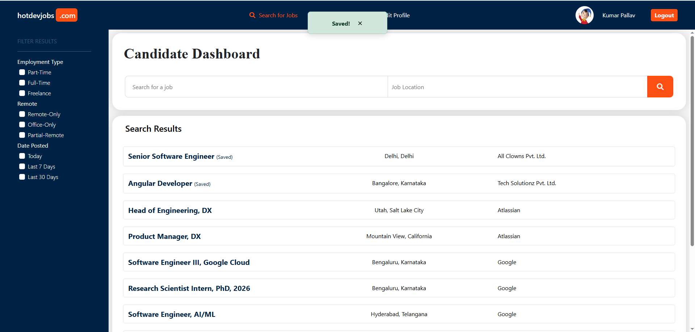

---

#### 🗂 Saved Jobs

Access all saved job listings from the **"View Saved Jobs"** link in the navbar, allowing candidates to revisit jobs they bookmarked.

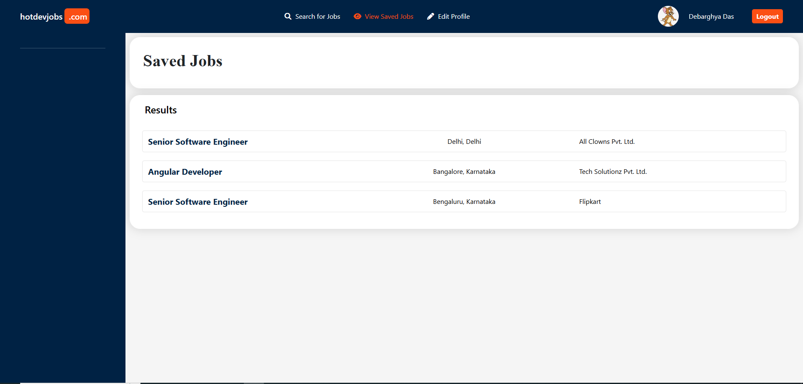

---

#### 👤 Candidate Profile

Edit your profile with:
- Personal details (Name, City, State, Country)
- Work classification (Work Authorization, Employment Type Preference)
- 🧠 **Skills** — Add multiple skills with Years of Experience and Level (Beginner / Intermediate / Advance)
- 🖼 **Profile Photo** — Upload a profile picture
- 📄 **Resume** — Upload a PDF resume

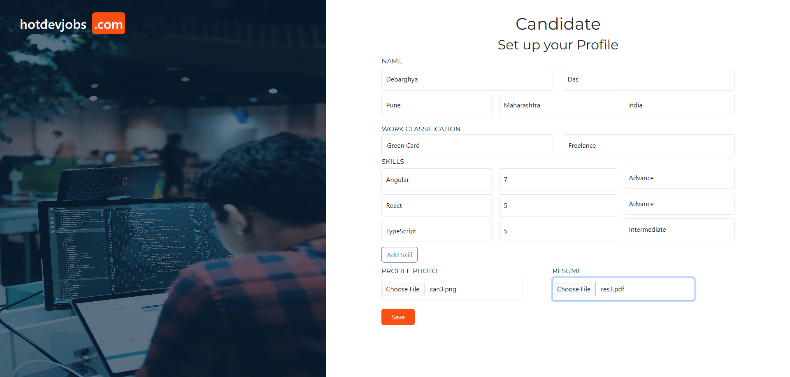

---

### 🏢 Recruiter Users

> Post jobs, manage listings, and review candidates.

#### 📊 Recruiter Dashboard

After logging in, recruiters see a dashboard listing all the jobs they have posted, along with the number of candidates who have applied.

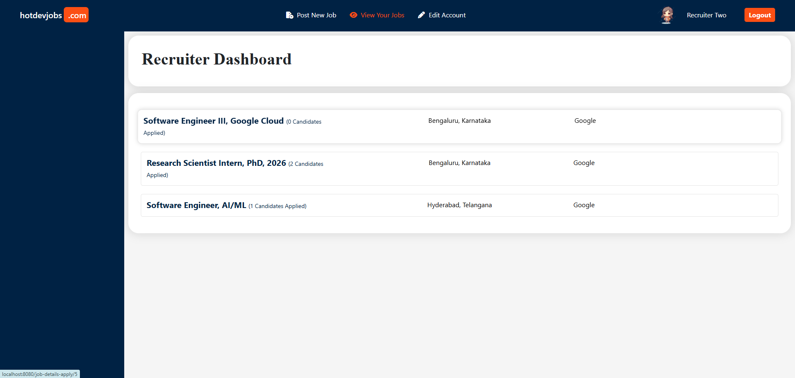

---

#### ➕ Post a New Job

Recruiters can create new job listings with:
- Job Title, Description (rich text editor), Salary
- Employment Type (Full-Time, Part-Time, Freelance)
- Remote Status (Remote-Only, Office-Only, Partial-Remote)
- Company Name and Location

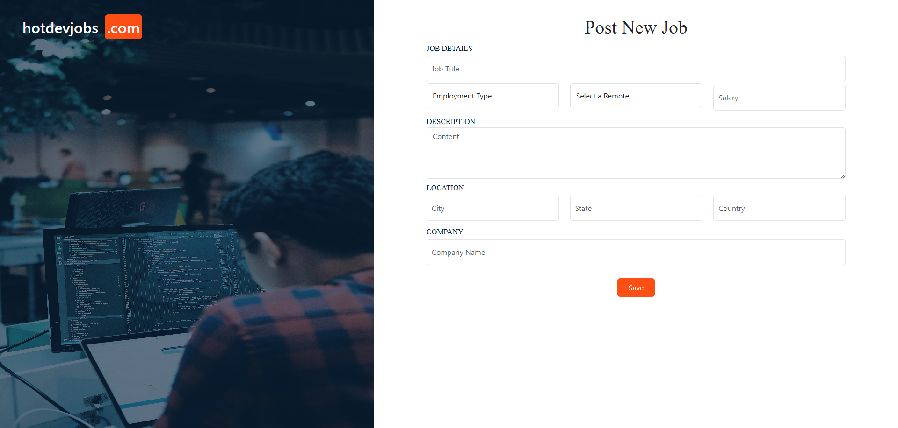

---

#### 🔍 Job Details & Management

Click on any job listing to view its full details. From the job details page, recruiters can:

- ✏️ **Edit Job** — Modify job details and re-save.
- 🗑 **Delete Job** — Permanently remove the job posting.

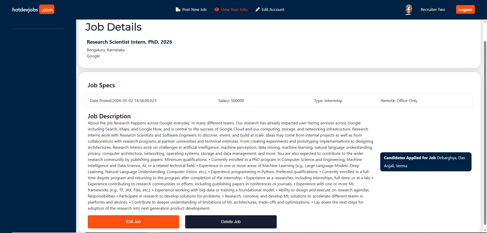
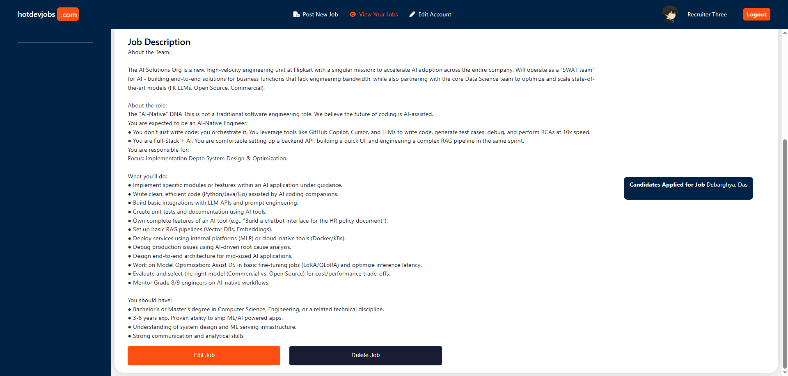

---

#### 🗑 Delete a Job

Clicking **"Delete Job"** removes the posting and all associated applications and saves, then redirects the recruiter to their dashboard with a confirmation toast.

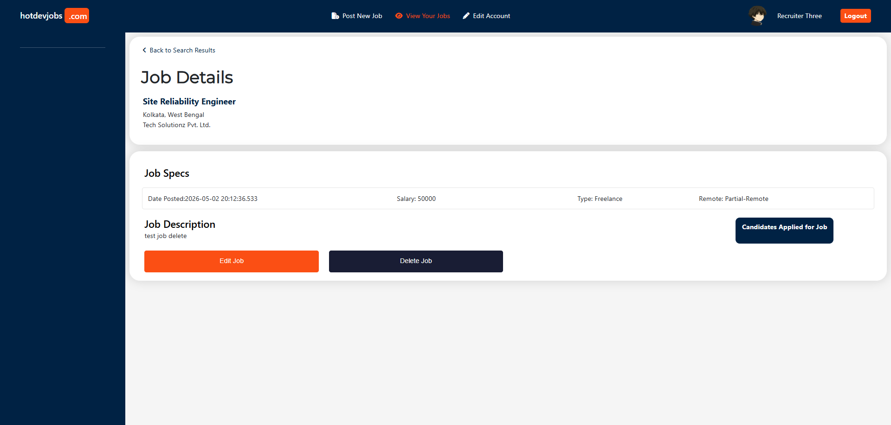

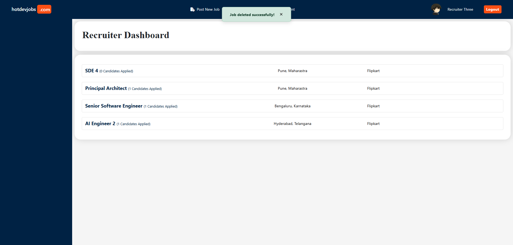

---

#### 👥 View Candidates Who Applied

On the job details page, recruiters can see the list of all candidates who have applied for the job.

---

#### 🔎 View Candidate Profile

Click on any candidate's name to view their complete profile — personal info, skills, experience levels, and profile photo.

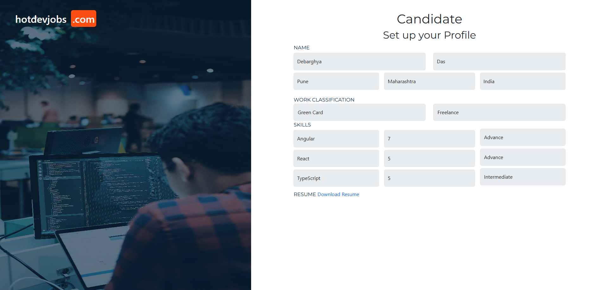

---

#### 📥 Download Candidate Resume

From a candidate's profile page, recruiters can **download the candidate's resume** as a PDF with a single click.

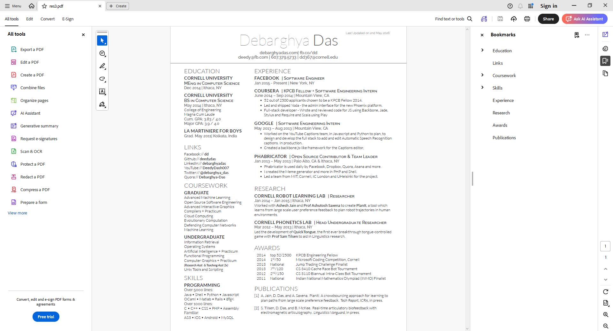

---

#### ✏️ Edit Recruiter Profile

Recruiters can edit their own account details via the **"Edit Account"** link in the navbar.

---

## ✨ UI Highlights

- **Animated Landing Page** — Cycling promotional text above the search bar using pure CSS keyframe animations.
- **Responsive Design** — Sidebar filters and content area adapt fluidly.
- **Toast Notifications** — Centered, auto-dismissing popups for Apply, Save, and Delete actions with distinct colour coding.
- **Role-Based Navigation** — The navbar dynamically shows only the links relevant to the logged-in user's role.
- **Disabled State Buttons** — "Already Applied" / "Already Saved" buttons are automatically disabled to prevent duplicates.
- **Smooth Hover Effects** — Job rows scale and elevate on hover for a polished, premium feel.

---

## 📁 Project Structure

```
src/main/java/com/dev/jobportal/
├── config/          # Spring Security configuration
├── controller/      # MVC Controllers (one per feature)
├── entity/          # JPA Entities
├── repository/      # Spring Data JPA Repositories
├── services/        # Business logic layer
└── util/            # File upload/download utilities

src/main/resources/
├── templates/       # Thymeleaf HTML templates
├── static/
│   ├── css/         # Custom stylesheets
│   ├── js/          # Custom JavaScript
│   └── assets/      # Background images & icons
└── application.properties
```

---

## 📄 License

This project is built for learning and demonstration purposes.
